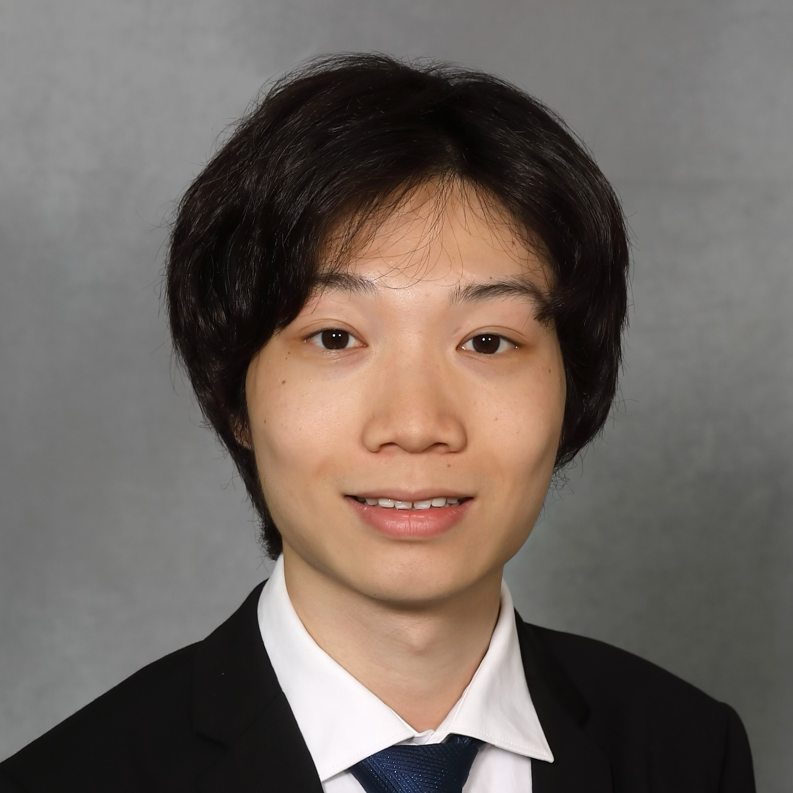

## About Me

I'm currently pursuing a Master of Engineering in Financial Engineering at Cornell University and will be graduating in December 2024. Before joining Cornell, I obtained my Bachelor's degree in Finance at Nanjing University. My academic interests center around stochastic modeling and machine learning, particularly their applications in quantitative finance. I hope to leverage my skills to innovate and drive forward the field of quantitative finance, contributing to the development of financial models and strategies that can withstand the complexities of the dynamic markets. Here is a copy of my [resume](https://aolueur.github.io/resume.pdf). After graduation from Cornell, I will be joining Beacon Platform Inc. as a Quantitative Developer Associate in early 2025.

In my free time, I enjoy classical music and have been playing the violin for over 16 years. During my undergraduate studies, I served as associate concertmaster in the college symphony orchestra for 4 years. I also have experience in playing string quartets, piano trios, piano and violin sonatas, and violin duets. My musical interests primarily lie in the works of German-Austrian composers from the baroque to the romantic period, and I am also a big fan of the 20th century music, especially the works of Shostakovich, Prokofiev, Stravinsky, and Bartók. While I have limited experience in comtemporary music, I'm always open to exploring new genres and styles. If you're interested in playing chamber music with me, please feel free to reach out to me!

### Contact

* Email: [yp439@cornell.edu](mailto:yp439@cornell.edu)
* Linkedin: [Yuao Peng](https://www.linkedin.com/in/yuao-peng-b1364125a)